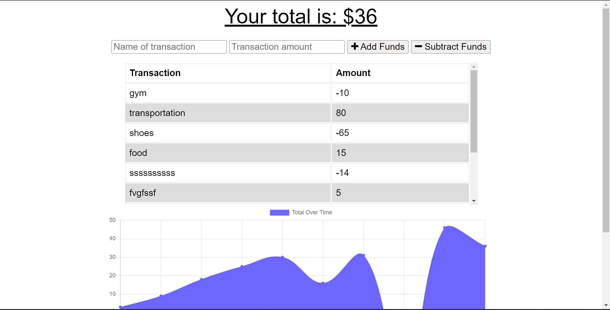

# Progressive-Web-Applications-PWA--Budget-Tracker

## User Story
```
AS AN avid traveler
I WANT to be able to track my withdrawals and deposits with or without a data/internet connection
SO THAT my account balance is accurate when I am traveling 
```
## Acceptance Criteria
```
GIVEN a budget tracker without an internet connection
WHEN the user inputs an expense or deposit
THEN they will receive a notification that they have added an expense or deposit
WHEN the user reestablishes an internet connection
THEN the deposits or expenses added while they were offline are added to their transaction history and their totals are updated
```

## Installation

To install the required dependencies, run `npm install`

## Usage

To start the server, run `npm start`. To access the app after starting the server, go to http://localhost:3001 in your browser.


## Screenshots


### Application Functionalities

- The ability to enter deposits offline.
- The ability to enter expenses offline.
- Offline entries should be added to the tracker when the application is brought back online

 ## Repository:
  * The URL of the deployed application: https://github.com/mobehnas/Progressive-Web-Applications-PWA--Budget-Tracker


